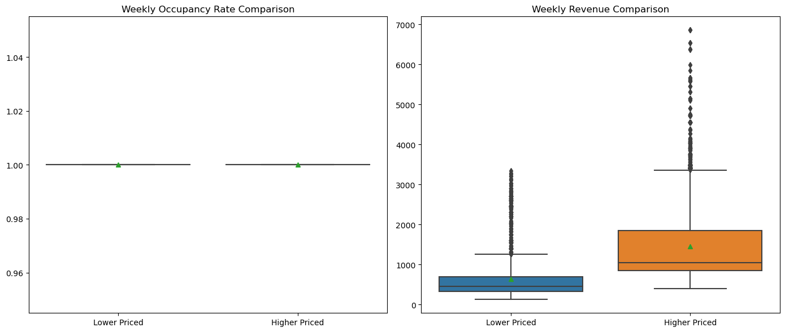
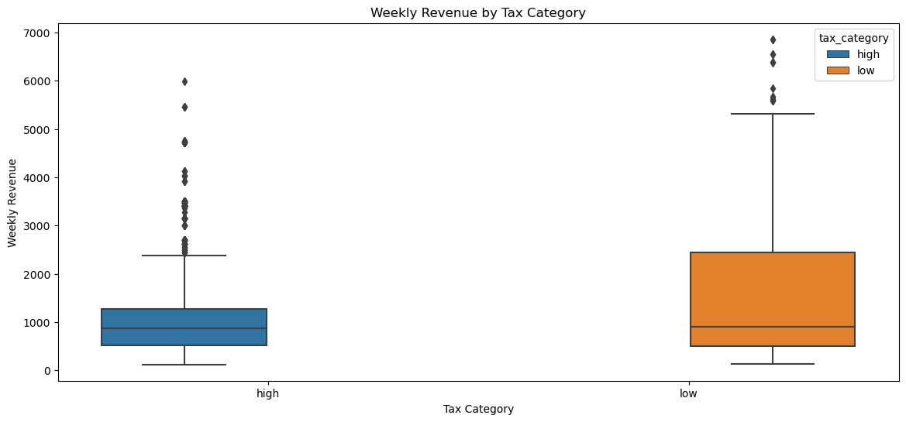
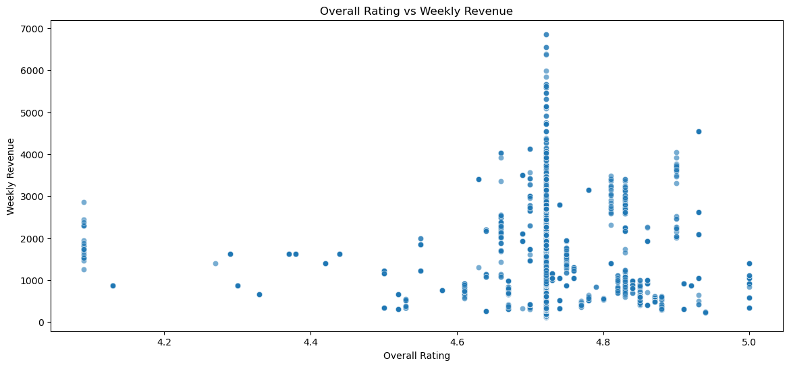
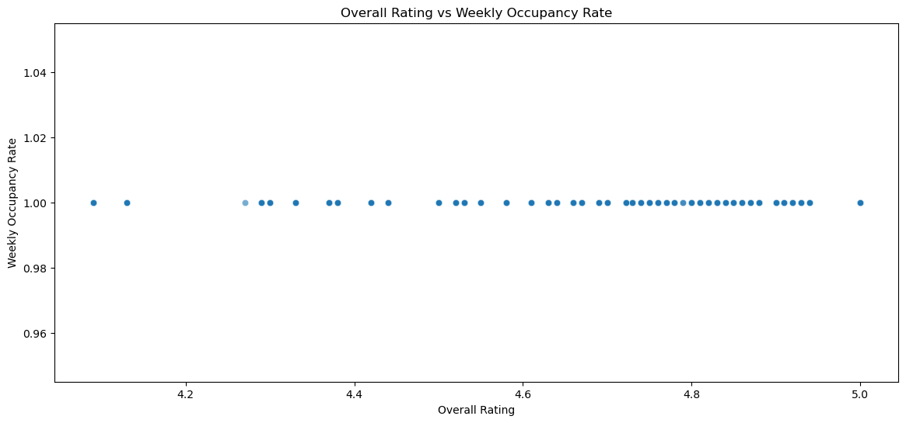
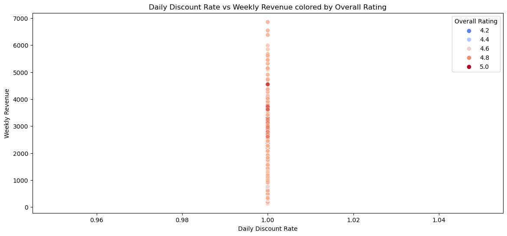
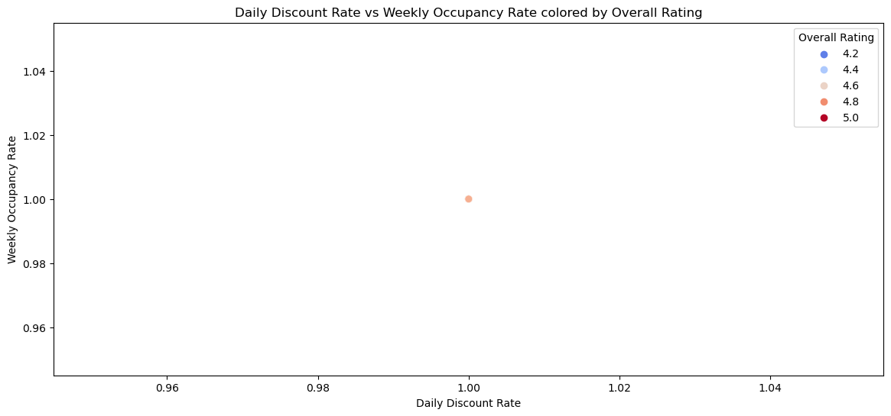

# MACSSThesis_shuyizhang: Effects of Price Reduction on Consumers’ Purchasing Behavior: Mediating Effect of Tax, Review Rate and Customer Insight

## Abstract
This study investigates the impact of price reduction on consumers' purchasing in the context of Airbnb listings, with an emphasis on the mediating role of tax rates, review ratings, and customer attributes. The research utilizes web-scraped data from Airbnb and U.S. state tax records to test various hypotheses. and employs time series multiple regression, propensity score matching, panel data regression, and cluster analysis. Key research questions include: 1) How can Airbnb hosts balance the trade-off between lower prices and occupancy rates? 2) Is tthe phenomenon of a higher occupancy rate and weekly revenue due to price promotions be more evident for Airbnb listings with higher review ratings? 3) Is the effect of price promotion on occupancy rate vary across different regions due to differences in tax rates? 4) Which consumer groups are more likely to be influenced by discounts and price promotions, and why? Will more experienced and loyal consumer groups (those Airbnb guests with higher number of review and number of years on Airbnb) be less affected by review rating and price promotions?

## 'Proof of Concept' & Mocked-up Results
- For Hypothesis 1, I expect that the weekly occupancy rate and weekly revenue would be higher when there is a higher daily discount rate.
- For Hypothesis 2, EDA shows that those with higher prices tend to generate greater weekly revenue in comparison to those with lower prices. I hypothesize that the weekly occupancy rate and weekly revenue would be higher for similar Airbnb listings.
  
- For Hypothesis 3, EDA shows that in states with high taxes, there are numerous data points that deviate significantly from the norm. In low tax states, there are more extreme outliers. Although states with low taxes may have the potential for more revenue, they also experience greater fluctuations. States with high tax rates offer a more consistent but potentially lower revenue. I hypothesize that in states where taxes are lower, the impact of a lower Airbnb price will be more significant.
  
- For Hypothesis 4, Listings with higher average ratings have a tendency to generate higher weekly revenue.
  
  
- For Hypothesis 5, listings with better overall ratings tend to be clustered towards higher weekly revenue. I expect this trend to continue. Also, I hypothesize that the weekly occupancy rates of listings with higher overall ratings would be higher.
  
- Likewise, there is a direct relationship between the average scores given in reviews and the rates of occupancy on a weekly basis. I expect this trend to continue with full dataset.
  

## Environment
This project uses the following language versions:
### Python
- Version: 3.11.5
### R
- Version: 4.3.2

## How to Cite
If you use this project in your research or work, please cite it as follows:
Zhang, Shuyi. (2024). MACSSThesisShuyizhang. GitHub. https://github.com/shuyizhang-macss/MACSSThesisShuyizhang
